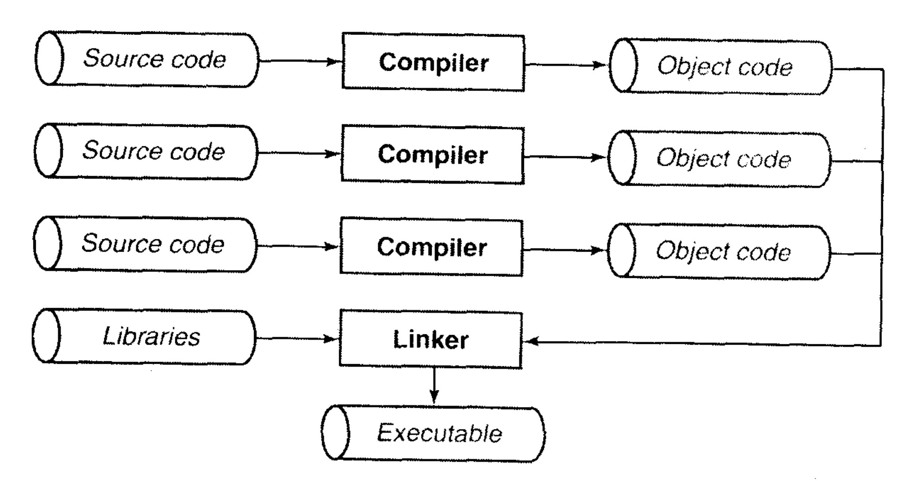
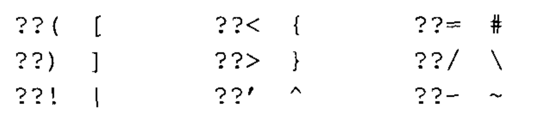

# 📘 Chapter 02 — 基本概念

> 本章笔记基于《Pointers on C》整理。包含核心概念、代码示例、思维误区与个人理解。

---

## 🧠 本章核心概念

- ✦ 概念1：环境
- ✦ 概念2：翻译
- ✦ 概念3：编译
- ✦ 概念4：执行
- ✦ 概念5：语法规则
- ✦ 概念6：程序形式

---

## 🔍 知识点详解

### ✅ 1. 环境
在 ANSI C的任何一种实现中，春在两种不同的环境。第一种是**翻译环境(translation enivironemnt)**即将源代码转换为可执行的机器指令。第二种是**执行环境(execution environment)**，他用于实际执行代码。

两个环境不必在同一台机器上，比如**交叉编译器(corss compiler)**。对于操作系统也是如此，一个不存在操作系统的环境就是**独立环境(freestanding environment)**。

### ✅ 2. 翻译(translate)
翻译阶段有几个步骤组成，组成程序的源文件通过**编译(compile)**分别转换为**目标代码(object code)**。目标代码是机器语言的初步形式。然后，各个目标文件通过<b>连接器(linker)</b>捆绑在一起，形成单一且完整的可执行程序。连接器同时也会引入C函数标准库和程序员个人程序库中任何所用到的函数，将其连接到程序中。如下图所示:

翻译后产生一个成为`a.out`的可执行程序，中间会产生一个`program.o`的目标文件，但是他会在连接过程中被删除。

当翻译源文件超过一个的时候，目标文件便不会被删除。这允许你对程序修改后，只对那个改动过的源文件重新编译。 

### ✅ 3. 编译
编译本身又由几个过程组成，首先是<b>预处理器(preprocessor)</b>处理。在这个阶段，预处理器会在源代码上执行一些文本操作。例如， 用实际值替代#define定义的符号, 以及读入由#include指令包含的文件内容。

然后源代码经过**解析(parse)**, 判断语句意思, 随后产生目标代码。如果在编译命令中加入优化选项, **优化器(optimizer)**会对代码进一步优化，使其效率更高。优化需要额外时间， 所以在程序调试中一般不进行这个过程。

### ✅ 4. 执行
程序在执行过程也需要经历几个阶段。首先出现必须载入到内存中。 在宿主环境中(也就是有操作系统)， 这个任务由操作系统完成， 那些不是存储在堆栈里未初始化的变量将在这个时候得到初始化。 然而在独立环境中， 程序载入必须手动, 通过将可执行代码载入到只读内存(ROM)来完成。

然后，程序便开始执行。 在宿主环境中，通常一个启动程序与程序连接在一起。 他一般负责一系列的日常事务，如收集**命令行参数**以便能够访问它们。接着，就是调用main函数。

现在就开始执行程序代码，程序将使用一个运行时**堆栈(stack)**, 它用于存储函数的局部变量和返回地址。 程序也可以使用<b>静态(static)</b>内存， 存储于静态内存的变量会在整个执行过程中一直保留它们的值。

最后也就是程序终止，他可以由不同原因引起。 正常的就是`main`函数返回。 在宿主环境中，启动程序将在此获得控制权，并执行不同的日常事务， 如关闭程序使用过但未关闭的文件。

### ✅ 5. 语法规则
<b>标识符(identifier)</b>就是变量，函数，类型等的名字。他由大小写，数字和下划线组成，但不能以数字开头。

标准定义了<b>三字母词(trigraph)</b>, 即三个字符合起来表示另一个字符，如下图:

### ✅ 6. 程序的形式
虽然一个源文件可以包含超过一个函数，但每个函数都必须完整出现在同一个源文件中，并且一个源文件应该包含一组相关的函数。这样做的优点就是使实现抽象数据类型成为可能。

1. 空行用于分割不同逻辑的代码段。
2. 在`if`等有括号的语句中，将表达式和括号间留一个空格使其看上去更突出。
3. 在表达式的的操作符使用中，中间都用空格来提高可读性，但是表达式太长时最好省略空格。
4. 在函数定义中，返回类型可以放在独立一行，而函数名字在下一行的起始处，这样你可以很快找到函数名字。

